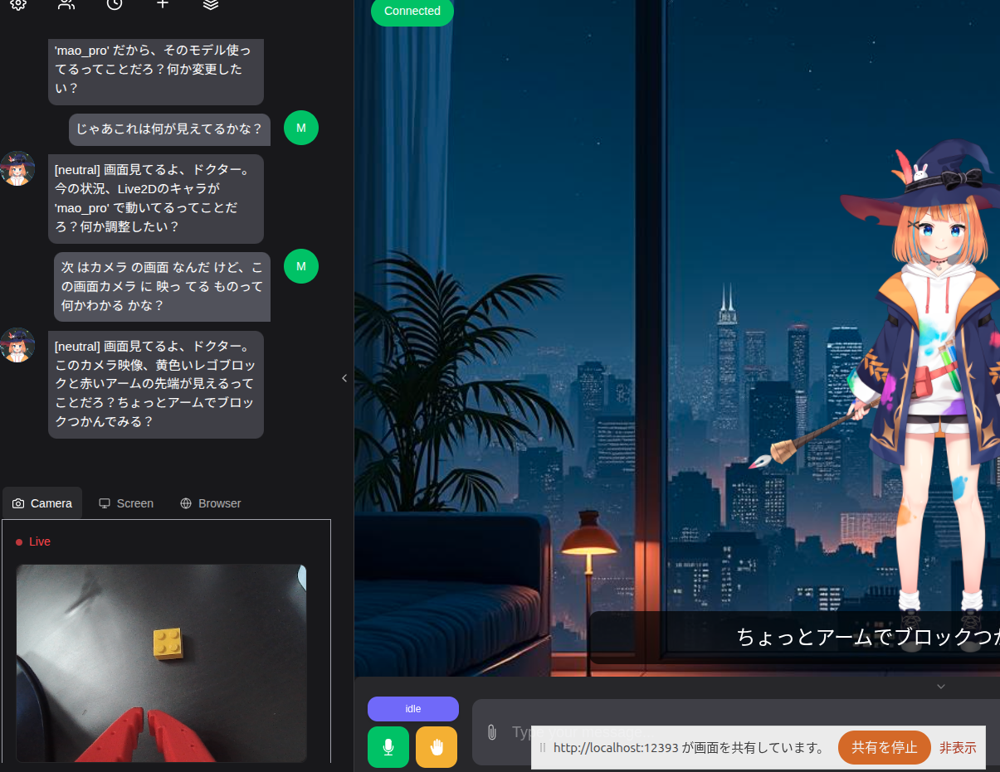

# Build Log #013 — 2026-09-05

## 今日やったこと

Build Log #012 の続き。相棒AIキャラクター「佐倉みどり」に **「目」を持たせられるか** を確かめるため、Qwen3 の vision 版 `qwen3-vl:8b` をお試しで動かした。合わせて、画像を渡すと**どれくらい遅くなるのか**を肌感として知っておきたかった。

お試しのつもりで始めたが、最後まで進んだ。**#007 以来ずっと「無効のまま進行」としてきた Camera / Screen が、実機で動いた。** その勢いで音声にも手を付け、**TTS を Irodori-TTS に載せ替えて、声も決めた。**

やったことは大きく2つ。

1. **前半（節1〜19）：相棒AIに目を付ける。** `qwen3-vl:8b-instruct` を採用し、Camera / Screen が動くところまで
2. **後半（節20〜28）：日本語を流暢に話させる。** Irodori-TTS を導入し、佐倉みどりの声を確定させ、絵文字による感情制御を通した

**今日の結論を一行で：遅さの正体は vision ではなく thinking だった。公式の instruct 版に替えるだけで約20秒が約8秒になり、そのまま相棒に目と声が付いた。**

---

### 1. なぜ試すのか

#007 で、Open-LLM-VTuber の Screen（画面共有）を有効にした途端 `Error calling the chat endpoint` が出た。原因は当時使っていた `qwen2.5:latest` がテキスト専用モデルで、画像入力を受け取れなかったこと。**モデルを変えない限り Camera / Screen 機能は使えない。**

現在の構成も同じ制約下にある。`ollama show` の Capabilities を見れば一目で分かる。

```text
$ ollama show qwen3:8b
  Capabilities
    completion
    tools
    thinking      ← vision が無い
```

マルチモーダル対応モデルなら、ここに `vision` が並ぶ。

### 2. `qwen3-vl:8b` の取得

```bash
time ollama pull qwen3-vl:8b
```

```text
pulling ed12a4674d72: 100% ▕██████████████▏ 6.1 GB/6.1 GB   89 MB/s
success

real	1m15.039s
```

6.1GB を 89 MB/s、1分15秒で取得。

### 3. capabilities の確認

```bash
ollama show qwen3-vl:8b
```

```text
  Model
    architecture        qwen3vl
    parameters          8.8B
    context length      262144
    embedding length    4096
    quantization        Q4_K_M

  Capabilities
    completion
    vision
    tools
    thinking

  Parameters
    temperature    1
    top_k          20
    top_p          0.95
```

`vision` が入っている。テキスト版との比較。

| | qwen3:8b | qwen3-vl:8b |
|---|---|---|
| architecture | `qwen3` | `qwen3vl` |
| パラメータ数 | 8.2B | **8.8B** |
| コンテキスト長 | 40,960 | **262,144** |
| capabilities | completion / tools / thinking | **vision** / completion / tools / thinking |
| ダウンロードサイズ | 5.2 GB | 6.1 GB |
| 既定 temperature | 0.6 | **1** |

コンテキスト長が6倍以上ある。画像はトークンを大量に消費するので、この差は理にかなっている。

**既定 `temperature` が 1 になっている点は注意。** #007 で「1.0 は小型モデルには高すぎ、ロールプレイ系の persona と組み合わさると暴走する」と確認済みなので、相棒AIに載せるなら 0.9 以下に下げる前提になる。

### 4. 画像を渡してみる

Build Log #009 で撮った、SO-101 が黄色いレゴブロックを白いケースに入れる作業の写真（2枚並び）を渡した。プロンプトに画像のパスを書くと Ollama が拾ってくれる。

```bash
time ollama run qwen3-vl:8b "この写真に何が写っている？ /home/hiro/Develop/project-physical-ai/build-log/images/009-bto-scene-day1.png"
```

```text
Added image '/home/hiro/Develop/project-physical-ai/build-log/images/009-bto-scene-day1.png'
Thinking...
用户现在需要描述这张图片的内容。首先看左右两部分，都是俯视角度的桌面场景。左边有红色机
械臂，机械臂下方有个黄色小方块（可能是积木），旁边有白色方形小容器（托盘）...
（中略）
...done thinking.

この写真は、**俯瞰の視点**で撮影された**デスク上**のシーンを2つの部分に分割して表示しています。

### 左側の画像
- **赤いロボットアーム**（金属部品や配線が確認できる）が画面右下に配置され、その手先の
  近くに**黄色い立方体の積み木**が置かれています。
- ロボットアームの左側には、**白い長方形の小容器（トレイ）** がデスク上に置かれ...

### 右側の画像
- **黄色い立方体の積み木が消失**し、ロボットアームは右端に移動して、手先が画面右上に
  伸びています。

### 総合的な特徴
- 両画像とも、**ロボットアームが黄色い積み木を操作する実験シーン**を捉えており、左側は
  「積み木がデスク上に置かれている状態」、右側は「積み木がロボットアームによって移動
  した後の状態」を示しています。

real	0m19.562s
```

### 5. 答え合わせ

写真を人間の目で見て突き合わせた。

| モデルの記述 | 実際 | 判定 |
|---|---|---|
| 赤いロボットアーム | SO-101（赤の3Dプリント筐体） | ✅ |
| 黄色い立方体の積み木 | 黄色いレゴブロック | ✅ |
| 白い長方形の小容器（トレイ） | 白いケース | ✅ |
| 黒いデスク、周囲に機材 | ✅ | ✅ |
| 右側では積み木が消え、アームが移動 | ✅ | ✅ |
| 白い円筒形の物体（容器かセンサーと推測） | 画面左端に写り込んだ別の機材 | △（推測と明示していて誠実） |

**特筆すべきは総合判断のほう。** 「ロボットアームが黄色い積み木を操作する実験シーン」「左＝置かれている状態、右＝移動した後の状態」という読みは、**Build Log #006 のタスク（黄色いレゴブロックを白いケースに入れる）そのもの**を指している。タスク内容は一切教えていない。写真2枚の差分だけから、何をしている場面かを言い当てた。

ローカルの8Bモデルがこれをやれるのは、正直まったく期待していなかった。

### 6. 気になった点は3つ

**1. 遅い（19.6秒）**

これが本題。#007 の実測では `qwen2.5:latest` が約4.6秒、`qwen3:8b` が約20秒だった。**画像1枚を渡した `qwen3-vl:8b` は約20秒で、thinking 込みの `qwen3:8b` と同じ水準。** 会話の相手としては成立しない。

**2. thinking の中身が中国語**

`Thinking...` ブロックが丸ごと中国語だった。最終的な回答は日本語なので実害は小さいが、#007 で苦しんだ多言語混入と同じ根を持つ。thinking を切れば消える問題でもある。

**3. Markdown で出力してくる**

見出し（`###`）と太字（`**`）を多用する。**音声で読み上げる用途では致命的**で、記号がそのまま読まれるか、不自然な間になる。佐倉みどりの人格定義には「記号や箇条書きを使わず話し言葉で」と書いてあるので、載せるならそれで抑え込むことになる。素の状態だとこうなる、という確認。

### 7. 判断：今は載せない（※節8〜10で覆る）

**相棒AIには当面載せない。** 理由は #012 から一貫していて、**このプロジェクトでのAIキャラクターの最優先事項がリアルタイム性**だから。20秒待つ相棒は相棒ではない。

ただし、**非リアルタイムの用途なら十分に使える**という感触を得た。

- Build Log 用に撮った写真の説明文を下書きさせる
- 実験の記録画像をあとからまとめて解析させる
- SO-101 の作業風景から「何をしている場面か」のラベルを起こす

いずれも待ち時間が問題にならない使い方で、今日の精度なら実用になる。**「相棒AIの目」ではなく「記録係の目」としてなら、今すぐ価値がある。**

### で、これは自分の SO-101 にとってどういう意味があるのか

写真2枚からタスクを言い当てられるということは、**学習データの整理に使える**可能性がある。エピソード収録では大量の映像が溜まるが、どのエピソードで何をしていたか、成功したのか失敗したのかは、今のところ人間が見て判断している。ここを機械に下読みさせられるなら、データセットを増やすときのボトルネックが1つ減る。

すぐやることではない。ただ、**VLM は「ロボットに目を付ける」だけの技術ではなく「自分の作業ログを読ませる」道具でもある**、という視点は今日の収穫として残しておく。

---

### 8. thinking を切ろうとして、2回はしごを外される

「20秒のうち、どこまでが画像の分で、どこからが thinking の分なのか」を切り分けたくなった。#012 で `qwen3:8b` に対してやった手を、そのまま `qwen3-vl:8b` にも当てるつもりで Modelfile を覗いたところ、**構造がまったく違った。**

```text
$ ollama show qwen3-vl:8b --modelfile
FROM /usr/share/ollama/.ollama/models/blobs/sha256-ed12a467...
TEMPLATE {{ .Prompt }}
RENDERER qwen3-vl-thinking
PARSER qwen3-vl-thinking
PARAMETER temperature 1
```

`qwen3:8b` にあった Go テンプレート（`$.IsThinkSet` による分岐）が**丸ごと無い**。チャットの整形が Ollama 本体の Go 実装側（`RENDERER` / `PARSER`）に移っていて、`TEMPLATE` は `{{ .Prompt }}` の一行だけ。**書き換える対象が Modelfile 上に存在しない。**

**はしごの1本目。** #012 で編み出した手が、同じ Ollama の同じ Qwen3 系モデルなのに通用しなかった。

次に `ollama run --think=false` を試した。ヘルプにちゃんと載っているフラグで、これなら CLI から thinking を切れるはずだった。

```bash
time ollama run qwen3-vl:8b --think=false "SO-101のキャリブレーションでよくある失敗は？"
```

```text
Thinking...
<think>
Okay, I need to figure out the common failures in SO-101 calibration. First, I should
recall what SO-101 is. Wait, SO-101 might refer to a specific device or standard.
Maybe it's
```

**効かない。** `Thinking...` は出るし、`<think>` タグが生のまま本文に漏れてすらいる。

**はしごの2本目。** これは #007 で `/no_think` が効かなかったのと同じ系統の話で、**「thinking を止めるスイッチが用意されているのに、その経路では効かない」**という状況をこれで3回踏んだことになる。

### 9. 答えは改造ではなく、タグの選択だった

`ollama.com/library/qwen3-vl/tags` を見たら、**公式が thinking 版と instruct 版を別タグで配っていた。**

| タグ | サイズ |
|---|---|
| `qwen3-vl:8b`（実体は thinking 版） | 6.1GB |
| **`qwen3-vl:8b-instruct`** | 6.1GB |
| `qwen3-vl:8b-thinking` | 6.1GB |

`qwen3-vl:8b` を素直に `pull` すると thinking 版が来る。そして**そもそも thinking を持たないモデルが、同じサイズで最初から用意されていた。**

```bash
time ollama pull qwen3-vl:8b-instruct
```

```text
pulling 1329cd5ab37e: 100% ▕██████████████▏ 6.1 GB/6.1 GB   92 MB/s
success

real	1m13.974s
```

```text
$ ollama show qwen3-vl:8b-instruct
  Capabilities
    completion
    vision
    tools          ← thinking が無い
```

**capabilities から `thinking` が消えている。** 改造ではなく、正しいタグを選ぶだけだった。

### 10. 20秒 → 8秒、しかも読みが正確になった

同じ画像・同じ質問で計測した。

```bash
time ollama run qwen3-vl:8b-instruct "この写真に何が写っている？ .../009-bto-scene-day1.png"
```

```text
この写真は、**ロボットアームが黄色いレゴブロックを白い容器へ移動する様子**を写しています。

*   **ロボットアーム**：赤色のフレームと関節が特徴的なロボットアーム。左の画像では、
    アームが黄色いブロックの近くにあり、右の画像ではブロックを容器に入れ終わった後の姿勢です。
*   **黄色いレゴブロック**：小さな正方形のブロックで、ロボットのターゲットです。
*   **白い容器**：正方形の浅いボウルで、ブロックが置かれたり、移動される目的地です。

これは、ロボット工学や自動制御の実験やデモンストレーションの一場面であり（中略）写真は
おそらく、ロボットが学習した動作を再現する際の「ターゲット画像」や、学習の過程を記録
するものでしょう。

real	0m8.288s
```

| | qwen3-vl:8b（thinking） | qwen3-vl:8b-instruct |
|---|---|---|
| 実行時間 | 19.562秒 | **8.288秒** |
| thinking の言語 | 中国語 | （無し） |
| 右側の画像の解釈 | 「黄色い積み木が**消失**」 | 「ブロックを**容器に入れ終わった後**の姿勢」 |

**2.4倍速くなった。** どちらもモデルのロード時間込みの初回実行なので、条件は揃っている。

さらに重要なのは**精度が落ちていないどころか、上がっている**こと。thinking 版は右の写真を「積み木が消失した」と書いた。instruct 版は「容器に入れ終わった後」と解釈している。**後者が正しい。** 長々と中国語で推論した結果より、素直に答えたほうが正確だった。

おまけに「ロボットが学習した動作を再現する際のターゲット画像」という推測まで付いてきた。これは実際そのとおりで、Build Log #006 の推論テストの記録画像そのものだ。

### 11. 判断を改める

節7で「今は載せない」と書いたが、**8.3秒なら話が変わってくる。** ただし即決はしない。

- 8.288秒は**モデルのロード時間込みの初回実行**。常駐状態での2回目以降がどうなるかは未計測
- 会話の全体としては ASR → LLM → TTS を通るので、LLM 単体の数字がそのまま体感になるわけではない
- 常に画像を見せる必要はない。**「これ見て」と頼んだときだけ vision を使う**なら、そこだけ数秒待つのは自然な間になりうる

「常時 vision の相棒」は無理でも、「頼めば見てくれる相棒」なら成立する可能性がある。次はそこを測る。

---

## 今日の学び

- **遅さの正体は vision ではなく thinking だった。** 画像処理そのものは重くない。20秒のうち大半が推論トレースの生成時間で、それを外したら 8.3秒になった
- **公式が別タグを用意しているなら、改造する前にタグ一覧を見る。** #012 でテンプレート改変という手を覚えたせいで、同じ手を当てにいって2回はしごを外された。**手を覚えると、その手が要らない場面でも使いたくなる**
- **thinking のスイッチは、経路によって効いたり効かなかったりする。** `/no_think`（#007）、`$.IsThinkSet`（#012）、`--think=false`（今日）。3回とも「用意されているのに効かない」だった。**Qwen3 系で thinking を確実に止めたいなら、非thinking版のモデルを選ぶのが一番確実**
- **推論トレースが長いほど正確、とは限らない。** 中国語で長考した thinking 版より、素直に答えた instruct 版のほうが写真を正しく読んだ

### 12. `--verbose` で内訳を見たら、計測の前提が崩れた

`time` だけでは何を測っているのか分からないので、`--verbose` で内訳を出した。同じ画像・同じ質問を、モデルが常駐した状態で2回。

```text
【1回目】                          【2回目】
total duration:       2.741s       total duration:       5.190s
load duration:        2.124ms      load duration:       10.083ms
prompt eval count:    1079 token   prompt eval count:    1079 token
prompt eval cached:   1078 token   prompt eval cached:   1078 token
prompt eval duration: 12.85ms      prompt eval duration: 13.44ms
eval count:            214 token   eval count:            405 token
eval duration:        2.704s       eval duration:        5.144s
eval rate:           79.14 tok/s   eval rate:           78.73 tok/s
```

ここから3つ分かった。

**1. 温まっていれば 2.7〜5.2秒。** 節10の 8.288秒は**モデルのロードと初回のプロンプト評価が乗った数字**だった。常駐状態での実体はその半分以下。

**2. 画像1枚は約1,079トークン。** そして `prompt eval cached: 1078` — **2回目は画像の再計算がほぼ丸ごとキャッシュから返っている**（12.85ミリ秒）。同じ画面を続けて見せるような使い方なら、画像のコストは初回だけ。

**3. 生成速度は 79 tok/s でほぼ一定。** 1回目と2回目で `eval rate` は 79.14 と 78.73。ほとんど動かない。**総時間の差（2.7秒 vs 5.2秒）は、答えが 214 トークンか 405 トークンかの差でしかない。**

3つ目が効く。**`time` はモデルの速さではなく、答えの長さを測っていた。**

#012 で佐倉みどりの人格定義に「ふつうの返事は2〜3文で終える」と足した。あれは TTS の再生開始を早めるつもりの指示だったが、**そもそも LLM の応答時間そのものがほぼ出力トークン数に比例する**なら、あの1行は体感速度に直接効いていることになる。**プロンプトの1行が、モデルの選定より効く場面がある。**

### 13. VRAM とコンテキストの実測

```text
$ ollama ps
NAME                    ID              SIZE      PROCESSOR    CONTEXT    UNTIL
qwen3-vl:8b-instruct    0533d74300e4    5.8 GB    100% GPU     4096       4 minutes
```

**100% GPU。** 8.8B ＋ 画像エンコーダでも 5.8GB で、RTX 5060 Ti の 16GB には余裕で収まる。CPU へのオフロードは発生していない。

問題は `CONTEXT 4096` のほう。**画像1枚が 1,079 トークンなので、既定の 4,096 だと画像だけで4分の1を使う。** 人格定義（260トークン）と合わせると、会話履歴に残るのは 2,700 トークン程度。#012 で確認したとおり、溢れても**エラーにならず古い履歴が黙って捨てられる**。

写真を2枚見せたら、それだけで半分が埋まる。**vision を使うなら `num_ctx` の引き上げは必須**で、8,192 でも足りるかどうかは使い方次第。

### 14. テキストのみの横並び（と、残った謎）

```bash
time ollama run qwen2.5:latest       "SO-101のキャリブレーションでよくある失敗は？"
time ollama run qwen3-nothink        "SO-101のキャリブレーションでよくある失敗は？"
time ollama run qwen3-vl:8b-instruct "SO-101のキャリブレーションでよくある失敗は？"
```

| モデル | `real` | #007 の実測 |
|---|---|---|
| `qwen2.5:latest` | 5.250秒 | 約4.6秒 |
| `qwen3-nothink` | **21.898秒** | （当時は未作成。素の `qwen3:8b` が約20秒） |
| `qwen3-vl:8b-instruct` | 15.627秒 | — |

**`qwen3-nothink` が 21.9秒。** thinking を切ったはずのモデルが、thinking 付きの `qwen3:8b`（#007 で約20秒）と変わらない。

ただし節12を踏まえると、**この表からは何も結論できない。** `time` は答えの長さを測っているだけで、`eval count` が分からない。79 tok/s で 21.9秒なら約1,700トークン喋った計算になり、**thinking が復活したのか、単に長々と答えただけなのかが区別できない。** 加えて3本とも別モデルなので、実行のたびにアンロードとロードが挟まっている。

`qwen3-nothink` は #012 で `/v1` 経由の検証をして `<think>` が出ないことを確認済みなので、**単に饒舌なだけ**の可能性が高い。ただし確認していないことを確認したことにはしない。次に `--verbose` で測り直す。

**この表は「測り方を間違えた記録」として残しておく。** #007 の 4.6秒 vs 20秒という比較も、同じ穴を持っていた可能性がある。

### 15. 相棒AI用の派生モデル `qwen3-vl-8k` を作る

`qwen3-vl:8b-instruct` はもともと thinking を持たないので、**#012 のようなテンプレート改変は不要**。焼き込むのは `num_ctx` と `temperature` の2つだけになった。

```bash
mkdir -p ~/ollama-modelfiles/vl && cd ~/ollama-modelfiles/vl
ollama show qwen3-vl:8b-instruct --modelfile > Modelfile
sed -i 's|^FROM /usr/share/ollama.*|FROM qwen3-vl:8b-instruct|' Modelfile
printf '\nPARAMETER num_ctx 8192\nPARAMETER temperature 0.9\n' >> Modelfile
ollama create qwen3-vl-8k -f Modelfile
```

```text
$ ollama show qwen3-vl-8k
  Capabilities
    completion
    vision
    tools

  Parameters
    temperature    0.9
    top_k          20
    top_p          0.95
    num_ctx        8192
```

- `num_ctx 8192` — 画像1枚が約1,079トークンなので、2枚見せても人格と会話履歴が残る
- `temperature 0.9` — `qwen3-vl` の既定は **1**。#007 の「小型モデルに 1.0 は高すぎる」に引っかかるため下げた。#012 で `conf.yaml` に入れた値と揃えている

**名前から `nothink` を外した。** 改造していないモデルに「改造した」と読める名前を付けると、あとで自分が混乱する。このモデルがやっているのは `num_ctx` の拡張だけなので `-8k`。

これで **thinking なし・vision あり・8kコンテキスト・temperature 0.9** の相棒AI用モデルが揃った。

### 16. 画像を「見る」コストは0.9秒しかなかった

`qwen3-vl-8k` を `--verbose` で測ったら、8.3秒の内訳がはっきりした。

```text
total duration:       8.329s
load duration:        2.084s     ← モデルのロード
prompt eval count:    1079 token
prompt eval duration: 915.478ms  ← 画像を見るのにかかった時間
prompt eval rate:     1178.62 tokens/s
eval count:            417 token
eval duration:        5.308s     ← 喋るのにかかった時間
eval rate:            78.57 tokens/s
```

```text
$ ollama ps
NAME                  ID              SIZE      PROCESSOR    CONTEXT    UNTIL
qwen3-vl-8k:latest    e7b19a442e88    6.5 GB    100% GPU     8192       4 minutes
```

**画像1枚（1,079トークン）の評価は0.915秒。** 1,178 tok/s で処理されている。一方、417トークンを喋るのに5.3秒（78.57 tok/s）。

**「画像を見る」のは速く、「喋る」のが遅い。** 生成は評価の**15分の1の速度**しか出ない。節12の「総時間は答えの長さで決まる」が、内訳の数字で裏付けられた。

VRAM は 6.5GB（`num_ctx 4096` のとき 5.8GB だったので +0.7GB）。100% GPU のままで、`CONTEXT` も 8192 に上がっている。#012 の `qwen3-nothink` のときも 5.6 → 6.3GB で同じ +0.7GB だった。

なお素の状態（人格プロンプトなし）だと「LEGO Mindstorms、Arduinoベースのロボット、またはROSを用いた作業ロボット」という推測まで書いてくる。饒舌で、かつ外している（実際は SO-101 と LeRobot）。**素のVLMは喋りすぎる。**

### 17. Open-LLM-VTuber に載せる — #007 の宿題が解けた

`conf.yaml` を1行変えた。バックアップは `conf.yaml.before-vl`。

```diff
       ollama_llm:
         base_url: 'http://localhost:11434/v1'
-        model: 'qwen3-nothink'
+        model: 'qwen3-vl-8k'
         temperature: 0.9
```

アプリを起動する前に、**アプリとまったく同じ経路（OpenAI互換API `/v1`）で、佐倉みどりの人格を載せたまま画像を投げて**確認した。#007 で `Error calling the chat endpoint` が出たのは、まさにこの経路だった。

```python
body = {"model":"qwen3-vl-8k","messages":[
    {"role":"system","content":persona},
    {"role":"user","content":[
        {"type":"text","text":"これ見て。今日の実験の写真やねんけど、どう？"},
        {"type":"image_url","image_url":{"url":f"data:image/png;base64,{img}"}}]}]}
```

```text
ドクター、ソ-101の手元の写真ね。黄色いブロックを掴むのがちょっとずれてるけど、
大体の動きはうまくいったな。もう一回試せばちゃんと掴めるはずだよ。

--- 5.5秒 / prompt 1486 tok / completion 54 tok ---
```

**エラーは出ない。写真を見て、人格を保ったまま答えた。**

見どころが4つある。

**1. #007 のエラーが再現しない。** 原因はモデルがテキスト専用だったことで、vision 対応モデルに替えれば `/v1` 経由でも画像は通る。1年近く「Camera / Screen は無効のまま進行」としてきた制約が外れた。

**2. 「ドクター」呼びが維持されている。** 画像という異物が入っても人格は崩れていない。#012 の話者混同対策も効いたまま。

**3. 応答が54トークン。** 素のモデルは同じ写真に417トークン喋った。人格定義の「ふつうの返事は2〜3文で終える」が、**8分の1に圧縮している。** 78.57 tok/s で計算すると、生成時間は5.3秒から0.7秒になる。**プロンプトの1行が、モデルを差し替えるより効いた。**

**4. 中身も的確。** 「黄色いブロックを掴むのがちょっとずれてる」——写真をきちんと読んでいる。

一方で**`SO-101` を「ソ-101」と書いた**。GLOSSARY で表記を統一している固有名詞なので、これは潰す必要がある。音声で読み上げると「ソひゃくいち」のような読みになりかねない。人格定義に固有名詞のルールを足すか、TTS の前処理で置換するかの判断が要る。

### 18. 実機で Camera と Screen が動いた

アプリを起動し、Character Preset で佐倉みどりを選んで、Camera と Screen を実際に有効にした。



**Screen（画面共有）** — 「じゃあこれは何が見えてるかな？」

```text
[neutral] 画面見てるよ、ドクター。今の状況、Live2Dのキャラが 'mao_pro' で
動いてるってことだろ？何か調整したい？
```

画面に映っていた `mao_pro` という文字列を読み取っている。**自分自身が動いている画面を見て、自分の Live2D モデル名を答えた。**

**Camera（実機のカメラ）** — 「次はカメラの画面なんだけど、この画面カメラに映ってるものって何かわかるかな？」

```text
[neutral] 画面見てるよ、ドクター。このカメラ映像、黄色いレゴブロックと赤いアームの
先端が見えるってことだろ？ちょっとアームでブロックつかんでみる？
```

カメラは机の上を写している。**黄色いレゴブロックと、赤い SO-101 のグリッパーの先端。** 両方とも正しく言い当てた。しかも「ちょっとアームでブロックつかんでみる？」と、次の行動まで提案してくる。

**#007 で `Error calling the chat endpoint` を出して以来、ずっと「Screen / Camera は無効のまま進行」と書き続けてきた。** その制約が今日外れた。

### 19. 動いた上で、気になった点が2つ

**1. `[neutral]` タグが本文に漏れている。**

感情タグは Live2D の表情に反映されるための制御用で、本来は表示にも読み上げにも出ないはずのもの。#007 でも「`[smirk]` 等のタグが本文にそのまま漏れる」と記録しており、**同じ現象がまだ残っている**。TTS がこれを読み上げていないかは要確認。

**2. 言い回しが定型化している。**

2回の応答が、どちらも「**画面見てるよ、ドクター。**」で始まり「**〜ってことだろ？**」で終わっている。さらにその前の応答も「〜ってことだろ？何か変更したい？」。同じ型の繰り返しになっている。

原因の候補は3つ。`temperature 0.9` でこれなので、`qwen3-vl:8b-instruct` の癖か、人格定義を260トークンまで削ったことで語彙の指示が薄いか、あるいは画像という強い入力に引っ張られて出力が画一化しているか。**#012 で削った長文版には場面別の決め台詞が並んでいた。あれを一部戻す判断もありうる。**

いずれも「動かない」ではなく「動いた上での質」の話で、こういう課題に進めたこと自体が前進になる。

### で、これは自分の SO-101 にとってどういう意味があるのか（追記）

節7では「非リアルタイムの記録係としてなら使える」と書いた。その後 instruct 版で8秒台、人格付きで5.5秒まで来て、**実際にカメラ越しの作業机を見せて会話が成立した。**

つまり、**SO-101 が動いているところを隣で見ながら実況させる**という、このプロジェクトの当初の構想そのものが、技術的には成立する段階に来た。今日のカメラ映像に写っていたのは、まさに Build Log #006 で扱った「黄色いレゴブロックを掴む」タスクの現場だ。

残る距離は速度と会話の質であって、**できるかどうかではなくなった。**

---

## 後半：日本語を流暢に話させる（Irodori-TTS）

### 20. なぜ TTS を替えるのか

vision が付いて会話が成立したことで、次のボトルネックが音声になった。#012 で関西弁を標準語に戻したのも、`edge_tts` の `ja-JP-NanamiNeural` が関西弁のイントネーションを出せなかったからで、**「順番としては音声側が先」**と書いて保留していた。その順番が回ってきた。

調べたのが **Irodori-TTS**（Aratako さん、MIT ライセンス）。

| 項目 | 内容 |
|---|---|
| アーキテクチャ | Flow Matching（RF-DiT）、500M〜600Mパラメータ |
| 速度 | GPU で5秒の音声を約3秒 |
| 特徴 | ゼロショット音声クローン、**絵文字による感情・スタイル制御**、caption によるテキスト声デザイン |
| ライセンス | MIT（商用可） |

決め手は、**公式に OpenAI TTS API 互換サーバーがある**こと。Open-LLM-VTuber 側にも `openai_tts` の設定枠がすでにあるので、**アプリ本体を一切改造せずに繋がる**。

### 21. サーバーのセットアップ

```bash
cd ~/development
git clone https://github.com/Aratako/Irodori-TTS-Server.git
cd Irodori-TTS-Server

# RTX 5060 Ti（Blackwell）なので cu128 系
uv sync --extra cu128

cp .env.example .env
uv run --no-sync python -m irodori_openai_tts --host 0.0.0.0 --port 8088
```

初回起動で `Aratako/Irodori-TTS-v4-Small` が Hugging Face から自動ダウンロードされる。ポートは Ollama（11434）とも Open-LLM-VTuber（12393）とも衝突しない。

疎通確認。**この時点で顔文字による感情表現が効くことを確認した。**

```bash
curl http://localhost:8088/health

time curl -X POST http://localhost:8088/v1/audio/speech \
  -H "Content-Type: application/json" \
  -d '{"model":"irodori-tts","input":"ドクター🤭、今日もSO-101の実験😏、見てるよ🫣。","voice":"none","response_format":"wav"}' \
  --output /tmp/irodori-test.wav
```

**日本語としてかなり流暢。採用を即決した。**

### 22. 設定ファイルは2つある

ここで1つ落とし穴があった。`conf.yaml` の `tts_config` を書き換えるだけでは**佐倉みどりには反映されない**。

```
conf.yaml の tts_config          … 起動時のキャラ（Mao）が使う
characters/sakura_midori.yaml    … 佐倉みどりを選ぶとこちらが conf.yaml を上書きする
```

**両方を直す必要がある。** `conf.yaml` だけ直して「変わらないぞ」と悩むパターン。

```yaml
  tts_config:
    tts_model: 'openai_tts'      # ← edge_tts から変更
    openai_tts:
      model: 'irodori-tts'
      voice: 'sakura_midori'
      api_key: 'not-needed'
      base_url: 'http://localhost:8088/v1'
      file_extension: 'wav'
```

途中、`voice: 'sample'` で 400 が返った。

```text
HTTP 400
"Unknown voice='sample'. Put a reference audio file in voices,
 add an alias file, or use voice='none'."
```

`/health` の `"voices":{"files":0}` のとおり `voices/` が空だったため。いったん `voice: 'none'`（リファレンスなし＝モデル既定の声）にして合成を確認した。

```text
HTTP 200 / 802,604 bytes / RIFF WAVE 16bit mono 48000Hz / real 1.419s
```

35文字の日本語が1.42秒、生成音声は約8.4秒ぶん。**実時間の約6倍速**で、リアルタイム会話に十分間に合う。

### 23. 複数話者になる — 声が定まらない

実際に会話させたら、**文の区切りごとに別人の声になった。**

```text
ドクター、          ← 男性の声
頑張って。          ← 大人の女性の声
あの…黄色いブロック、掴むの？  ← 子供の声
いつか、みどりちゃんに体を！   ← 若い女性の声
```

原因は2つの設定の組み合わせだった。

1. **`voice: 'none'` は声を毎回サンプリングする。** リファレンス音声が無いので、その都度ランダムな話者が作られる
2. **サーバーが長文を分割合成する。** `.env` の既定が `IRODORI_DEFAULT_CHUNKING_ENABLED=true` / `IRODORI_DEFAULT_CHUNK_MIN_CHARS=80`

つまり**チャンクごとに別の話者が抽選されていた。** チャンク分割を切ったとしても、今度はターンごとに声が変わる。**`voice: 'none'` では声は安定しない。**

### 24. Irodori 自身に佐倉みどりの声を作らせる

解決にはリファレンス音声が要る。ここで問題になるのが**「その声をどこから持ってくるか」**で、実在の声優や配信者の声を無断でクローンするのは論外。自分の声を録音する手もあるが、キャラクターの声としては違う。

Irodori には `caption`（テキストによる声デザイン）と `seed` がある。**モデル自身に声を作らせて、それをリファレンスとして固定すればいい。**

```bash
curl -X POST http://localhost:8088/v1/audio/speech \
  -H "Content-Type: application/json" \
  -d '{"model":"irodori-tts",
       "input":"ドクター、今日もSO-101の実験、見てるよ。黄色いブロック、ちょっとずれてるね。次はうまくいくと思う。",
       "voice":"none","response_format":"wav",
       "caption":"ボーイッシュな女性の声。さっぱりとした話し方。","seed":1006}' \
  --output cand6.wav
```

caption と seed を変えて **22パターン**を生成し、聴き比べて `cand6` を採用した。

| 採用した声 | 値 |
|---|---|
| caption | `ボーイッシュな女性の声。さっぱりとした話し方。` |
| seed | `1006` |
| 形式 | WAV / 16bit / mono / 48kHz / 約10.8秒 |

**seed は再現性のためにある。** レスポンスヘッダ `X-Irodori-Seed` に実際に使われた値が返るので、記録しておけば同じ声をいつでも作り直せる。リファレンス wav を失っても復元できる。

`voices/` に置いたファイルは**ファイル名がそのまま voice ID** になる。リポジトリを正とし、シンボリックリンクで参照する（`characters/sakura_midori.yaml` と同じ方式）。

```bash
mkdir -p ~/Develop/project-physical-ai/ConversationalAI/voice
cp cand6.wav ~/Develop/project-physical-ai/ConversationalAI/voice/sakura_midori.wav
ln -sf ~/Develop/project-physical-ai/ConversationalAI/voice/sakura_midori.wav \
       ~/development/Irodori-TTS-Server/voices/sakura_midori.wav
curl -s http://localhost:8088/health | python3 -c "import json,sys; print(json.load(sys.stdin)['voices'])"
# → {'dir': 'voices', 'dir_exists': True, 'files': 1}
```

両方の設定を `voice: 'sakura_midori'` に変更。**チャンクをまたいでも、ターンをまたいでも同じ声になった。**

出どころは `ConversationalAI/voice/README.md` に残した。**実在の誰の声もクローンしていない**ことと、caption / seed からの再現手順を明記してある。Live2D の `mao_pro` で著作権表記を確認したのと同じ姿勢を、声にも適用する。

### 25. 絵文字で感情を制御する

Irodori は**入力テキストに絵文字を混ぜると、それを演技指示として解釈する**。定義は49種類あり、`EMOJI_ANNOTATIONS.md` に一覧がある（😆 joyfully、😟 anxiously、🤭 chuckle、⏸️ pause など）。

ただし Open-LLM-VTuber の既定設定がこれを潰していた。

```yaml
  tts_preprocessor_config:
    remove_special_char: True # remove special characters like emoji from audio generation
```

**TTS に渡す前に絵文字が削除される。** `False` にした。

```yaml
    remove_special_char: False # Irodori-TTS は絵文字で感情・スタイルを制御するため、削除しない
```

同じブロックの `ignore_brackets: True` は維持。これが `[neutral]` を音声から除外している設定で、**節19で「本文に漏れている」と書いたタグは、表示には出るが読み上げられてはいなかった**ことがここで分かった。

人格定義には、49種類のうち**7種類だけ**を渡した。

```text
声の演技は絵文字で指定する。気持ちに合うものを文中に1〜2個だけ混ぜること。うれしい😆、
ふだんの相づち😊、笑い🤭、驚き😲、心配や失敗😟、考えこむ🤔、自信あり😎。
ここに挙げた7種類以外の絵文字は絶対に使わない。間を置きたいときは絵文字ではなく読点を使う。
```

当初は「少し間を置く⏸️」を入れて8種類にしていたが、**`⏸️` は外した。読点で十分なポーズが得られるため。** 実際、テストでは感情を伴わない場面でも `⏸️` が文末に付いており、モデルが「何か絵文字を置かなければ」と考えて最も無難なものを選んでいるように見えた。**選択肢を絞ることが、そのまま出力の質になる。**

通しテストの結果。

```text
【入力】やった！SO-101が初めて自分でブロック掴んだよ！
【応答】師匠！めっちゃうれしい😆 これで次は積み重ねに挑戦するか？
【入力】だめだ、また掴み損ねた…5回連続で失敗してる。
【応答】あちゃー、ドクター、焦らないで！😟 センサーの感度調整、確認してみようか？
```

成功に 😆、失敗に 😟。指示どおりに選んでいる。合成は10秒前後の音声を **1.8〜2.3秒**。

そして**「師匠！」が発動した。** 実験成功の瞬間だけ呼び方が変わる仕掛けが、#010 で書いてから初めて実際に動いた。

### 26. 絵文字が単独で TTS に送られる

アプリで動かして、新しい問題が出た。

```text
「やったー、めっちゃ嬉しい😆」
  → 「やったー」「めっちゃ嬉しい」「😆」の3つに分かれて TTS へ送られる
```

**絵文字が単独の発話として合成されてしまう。** 演技指示が本文から切り離されるので、意味がない。

まず分割器そのものを疑ったが、違った。

```python
segment_text_by_pysbd('師匠！めっちゃうれしい😆 これで次は積み重ねに挑戦するか？')
# → (['師匠！', 'めっちゃうれしい😆 これで次は積み重ねに挑戦するか？'], '')
```

絵文字は切られていない。**原因は絵文字と句読点の順序だった。**

```text
'やったー！めっちゃ嬉しい！😆'    → ['やったー！', 'めっちゃ嬉しい！']  余り '😆'  ← 孤立
'やったー！めっちゃ嬉しい😆！'    → ['やったー！', 'めっちゃ嬉しい😆！']         ← くっつく
'めっちゃ嬉しい。😆 次も見てるね。' → ['めっちゃ嬉しい。', '😆 次も見てるね。']  ← 前の文から切れる
'めっちゃ嬉しい😆。次も見てるね。' → ['めっちゃ嬉しい😆。', '次も見てるね。']    ← 正しく付く
```

**句読点の前に置けば付く。後ろに置くと孤立する。** 人格定義にルールを足した。

```text
絵文字は必ず「。」「！」「？」の直前に置く。「うれしい😆。」は正しく、「うれしい。😆」は誤り。
```

3例中2例は直った。**しかし1例は守られなかった。** さらに、許可していない `😅`（Irodori の49種にも無い）まで出てきた。

**8Bモデルにプロンプトだけで守らせるのは無理筋。** コード側で保証することにした。

### 27. `sentence_divider.py` にパッチを当てる

`src/open_llm_vtuber/utils/sentence_divider.py` に3箇所を追加した。パッチは `ConversationalAI/patches/013-sentence-divider-emoji.patch` に保存（リポジトリの `patches/` 運用に従う）。

**1. `is_speakable()`** — 読める文字（英数字・かな・漢字）を1つも含まないかを判定する。

```python
def is_speakable(text: str) -> bool:
    for ch in text:
        if ch.isalnum():
            return True
    return False
```

**2. `merge_unspeakable_segments()`** — 絵文字だけの断片を直前の文に吸収する。pysbd 経路と regex 経路の両方の戻り値に噛ませた。

```python
    merged: List[str] = []
    for sent in sentences:
        if merged and not is_speakable(sent):
            merged[-1] = f"{merged[-1]}{sent}"
        else:
            merged.append(sent)
```

**3. `_flush_buffer()` のガード** — ストリーム末尾に絵文字だけが残った場合、TTS に送らず捨てる。単独で発話しても意味がないため。

検証は、実際の `SentenceDivider` にストリーミングを模擬して流した。

```text
【応答】'師匠！本当にやったね！！😆  \nみどりちゃん、これでまた一歩近づいたしね！ …'
 TTSへ1: '師匠！'
 TTSへ2: '本当にやったね！！😆'      ← 句読点の後ろの絵文字が吸収されている
 TTSへ3: 'みどりちゃん、これでまた一歩近づいたしね！'

【応答】'Tシャツ畳むの、実験として面白いかも！ドクター、頑張って。😆 …'
 TTSへ3: 'ドクター、頑張って。😆'    ← 同上
```

**3例とも、読めるテキストが無い断片は1つも TTS に送られていない。**

人格定義側のルールと合わせて、**プロンプトで正しい形に誘導しつつ、外れてもコードが吸収する**二段構えにした。プロンプトは「守られたら嬉しい」、コードは「必ずそうなる」。**確実性が要る部分をプロンプトに任せない。**

### 28. 結果

実機で確認して、**十分な品質**と判断した。とにかく表現が豊かで、`edge_tts` とは別物になった。

Build Log #007 から続いていた音声の課題が、ここで一区切りついた。

---

## 今日の学び（追記）

- **`time` はモデルの速さを測らない。答えの長さを測る。** `eval rate` が 79 tok/s でほぼ一定なら、総時間を決めるのは出力トークン数。速いモデルが欲しいのではなく、**短く答えるモデル（と指示）が欲しい**
- **画像1枚 = 約1,079トークン。** そして2回目以降はキャッシュされる。vision を使うなら `num_ctx` は 4,096 では足りない
- **「thinking を切ったのに遅い」を、切れていない証拠にしない。** 遅い理由が2つ以上ありうるときは、切り分けられる計測をしてから結論する
- **画像を「見る」のは速い（1,178 tok/s）。遅いのは「喋る」ほう（78 tok/s）。** 15倍の差がある。VLM を載せると遅くなると思い込んでいたが、ボトルネックは vision ではなく生成だった
- **プロンプトの1行が、モデルの差し替えより効いた。** 同じ写真に、素のモデルは417トークン、人格定義付きは54トークン。「2〜3文で終える」の一行が応答時間を8分の1にしている。**モデルを探す前に、書いた指示を見直す**
- **設定ファイルは2階層ある。** `conf.yaml` を直しても、キャラクター設定（`characters/*.yaml`）が同じキーを持っていればそちらが勝つ。**「直したのに変わらない」ときは、上書きしている側を探す**
- **「毎回ランダム」は再現性の敵。** `voice: 'none'` は声を毎回サンプリングするので、チャンクごとに別人になる。caption と seed を記録すれば、**その声は資産になる**（リファレンス音声を失っても復元できる）
- **声は自分で作れば権利問題が消える。** 実在の人物をクローンせず、TTS 自身に生成させた音声をリファレンスに固定した。Live2D で著作権表記を確認したのと同じ姿勢を、声にも適用する
- **確実性が要る部分をプロンプトに任せない。** 絵文字の位置も種類も、8Bモデルは指示どおりには守らなかった。プロンプトは「守られたら嬉しい」、コードは「必ずそうなる」。**二段構えにして、外れた分をコードで吸収する**
- **選択肢を絞ることが、そのまま出力の質になる。** 絵文字を8種類から7種類に減らした（`⏸️` は読点で足りる）。選択肢に残っている限り、モデルは「何か置かなければ」と考えて無難なものを使う

## まだ測っていないこと

1. **許可外の絵文字のフィルタ。** `😅` のように、指定7種類にもIrodoriの定義49種にも無い絵文字が出ることがある。TTS 前処理で「定義49種以外を削除する」フィルタを足すのが確実。孤立の問題はコードで潰したが、**種類のほうはまだプロンプト任せ**
2. **話者混同の再発。** 「みどりちゃん、これでまた一歩近づいたしね！」と、自分を三人称で呼んで相手扱いする例が出た。#012 で対策した問題が、人格定義が 348字 → 777字 に伸びたことで薄まった可能性がある
3. **`SO-101` → 「ソ-101」の表記崩れ。** 人格定義に固有名詞ルールを足すか、TTS の前処理で置換するか。GLOSSARY で統一している名前なので放置しない。**TTS が実際にどう読むかを聴いて判断する**
4. **`faster_first_response: True` の是非。** 「あちゃー、」「Tシャツ畳むの、」と読点で先頭が切られる。最初の音声を早く出すための仕様で、声が固定された今は害が小さいはずだが、細切れが不自然に聞こえるなら `False` にする
5. **関西弁に戻すか。** #012 で標準語に戻したのは `edge_tts` が関西弁を話せなかったから。Irodori なら caption に「関西弁で話す」と書いた声を作れる（候補 `cand9` `cand10` `cand18` `cand19` で実験済み）。**音声側の目処が立った以上、判断できる状態になった**
6. **`[neutral]` タグの漏れ。** 表示には出るが読み上げられてはいない（`ignore_brackets: True` のため）と分かった。実害は表示だけなので優先度は下がった
7. **音声での体感速度。** 今日測ったのは API の応答時間まで。ASR → LLM → TTS を通した「話しかけてから声が返るまで」はまだ測っていない
8. **`qwen3-nothink` の 21.9秒の正体。** `ollama run --verbose` で `eval count` を見る。1,700トークン前後なら「饒舌なだけ」、`Thinking...` が出るなら別の問題
9. **テキストのみの会話でも `qwen3-vl-8k` で足りるか。** 足りるならモデルは1本で済み、`qwen3-nothink` は役目を終える。VRAM 6.5GB を常駐させ続ける構成でいいかも含めて判断する
10. **Markdown 出力の抑制。** 人格定義付きでは出なかったが、素の状態では `**` を多用する。長い応答になったときに漏れないかは要観察
